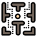

# The Maze Runner 
- [Introduction](#introduction)
- [Key Features](#key-features)
- [Resources](#resources)
## Introduction
***Welcome to the Maze*** where not everyone can escape. Solve the 3D (or 2D) maze in the shortest time possible. The maze is generated randomly after each round so there is no use trying to memorize the layout. And knock yourself out with unlimited number of maze *(not mathematically true)*.
 
<u>***Player Movement***</u>: 
- LEFT: rotate counter clock-wise
- RIGHT: rotate clock-wise
- UP: move forward
- DOWN: move backward <!-- omit in toc -->
---
## Key Features
- ***Randomly Maze Generator*** - The program uses depth-first search algorithm to generate the maze randomly. The way it works is to initially mark all cells (individual squares) of a square grid as unvisited. Then, it randomly selects a neighboring cell and marks it as visited as well as opens a path to that cell. From that newly visited cell, it repeats the process of random selection to traverse through the cells. If the current visited square does not have any unvisited neighbor, the program goes back to the previous cell, creating a recursive process that will only end when all cells of the grid have been visited. As a result, a maze is generatred with paths opening to next cells, creating random paths. 

   
Taken from <a href="https://en.wikipedia.org/wiki/Maze_generation_algorithm">Wikipedia</a>

- ***Ray Casting & Ray Rendering***: Ray casting algorithm is also used to establish the player's Field of View (FOV) in both the 2D map and 3D view. Line-line intersection formula was used to determine whether two lines intersect. Next, the algorithm is optimized by checking the walls of the cell it could reach rather than every single wall of the maze. This is done via checking whether a ray has passed through an opening or hit a wall. The ray is then rendered using the length of the ray which can be calculated using the interesction point and player's position. The "3D screen" is splitted into rectangles with the same numbers of rays. Each slice has a height and brigthness depending on the length of ray or distance of player to a wall. As such, when drawn to the screen, depth of the maze can be perceived, creating a 3D illusion.

- ***Cheat code*** - It is quite a long maze so I included a cheat code in [Player.pde](Player.pde) on line 158. The code allows you to go through the green gate and teleport to the end. Use it to see how the maze is randomly generated each time 

NOTE: it is by no means a perfect 3D view so when it feels like you're stuck and can't move despite the clear area ahead, you are actually colliding with a wall. So, use the 2D map to get yourself out of that situation. 
## Resources
I took great inspiration from Daniel Shiffman's Youtube channel, [The Coding Train](https://www.youtube.com/channel/UCvjgXvBlbQiydffZU7m1_aw). These three videos gave me the idea for the game:
- [2D Ray Casting](https://www.youtube.com/watch?v=TOEi6T2mtHo&t)
- [Rendering Ray Casting](https://www.youtube.com/watch?v=vYgIKn7iDH8)
- [Maze Generator](https://www.youtube.com/watch?v=HyK_Q5rrcr4&t)

Maze icon by [Icon8](https://icons8.com)

P.S.: The videos only serve as brainstorming material. All work done was independent and through research.
